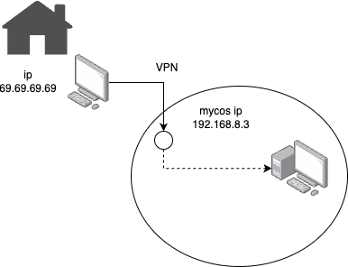
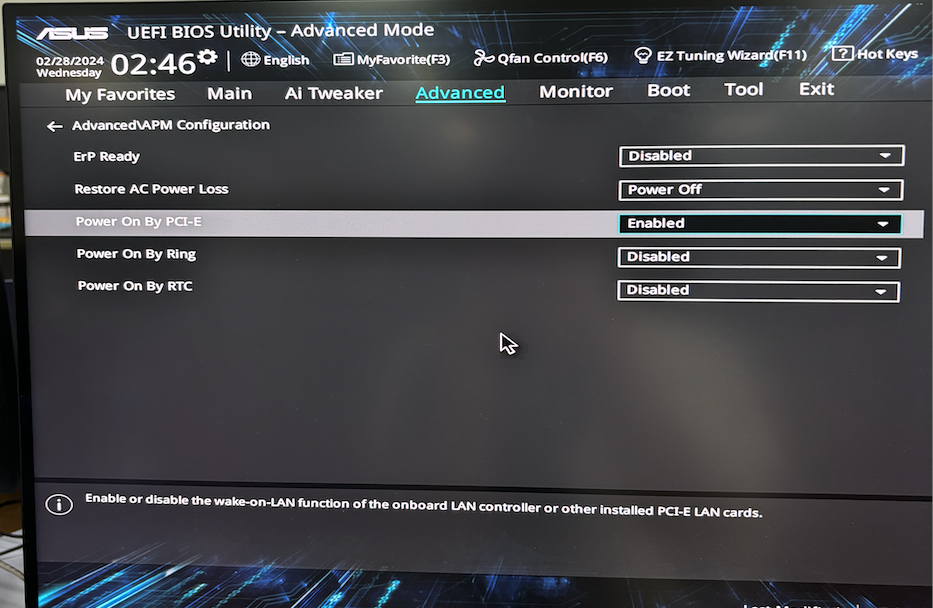

# Remote development via Visual Studio Code 🧑‍💻 (with SSH)
Prevent my machine hanging, share process to other maching via SSH remote.
open MyCos session


ref: https://code.visualstudio.com/docs/remote/remote-overview

## Objective
  - Able to remote dev from macos which use window for complie and codebase.
  - Using other computer compile with my GUI code and forward port to my machine.

## Disclaimer
  - This is not the best way for remote working.
  - Cannot remote visual studio especially, old version 2013, 2017, 2019
  - Cannot ssh to AzureAD local login (maybe can but not deep research yet)
  - Faster or Convenience over GUI like Team Viewer or Remote Desktop? No, just another way for remote work.

## Table of Contents
1. [Pre Installlation](#pre-installlation)
2. [What is SSH?](#what-is-ssh)
3. [Time to Connect to Remote](#time-to-connect-to-remote)
4. [Forward Port](#forward-port)
5. [Public Key Authentication](#public-key-authentication)
6. [WFH Problem use VPN](#wfh-problem-use-vpn)
7. [Wake on Lan](#wake-on-lan)
8. [Other remote ways](#other-remote-ways)


## Pre Installlation
we need theses tools
### Client Side
1. [Visual Studio Code](https://code.visualstudio.com)
2. [Remote Devlopment Extension](https://marketplace.visualstudio.com/items?itemName=ms-vscode-remote.vscode-remote-extensionpack)
3. Open SSH Client
   - Macos -> Already had from OS
   - Window -> Install the [Windows OpenSSH Client](https://learn.microsoft.com/en-us/windows-server/administration/openssh/openssh_install_firstuse?tabs=gui)

### Remote Side
1. Windows - Install the [Windows OpenSSH Server](https://learn.microsoft.com/en-us/windows-server/administration/openssh/openssh_install_firstuse?tabs=gui)
2. Macos - [Enable Remote](https://support.apple.com/guide/mac-help/allow-a-remote-computer-to-access-your-mac-mchlp1066/mac)
3. Create a machine user if no user yet (if the codebase need admin user please create user with admin role)

## What is SSH
SSH aka Secure Shell, is a cryptographic network protocol used for secure communication between a client and a server over an unsecured network.

working on Port 22
- access to remote via cli
- transfer file between them
- etc.
  
## Time to Connect to Remote
after we installed tools what we need, now it time to connect to remote via ssh
open terminal or cmd or powershell then, 

```
ssh hostusername@domain@hostaddress
```
it may prompt for typing password

## Forward Port
After we connected remote, then we can forward port from remote to run in our local machine.


## Public Key Authentication
We conect to remote and italways prompts to enter remote's user password, now we can ignore them.
after we stored client's public key in remote, top level step that first client request/ping to remote then remote send back with random message encypt with public key which only private key in client can decypt
then client send decypt message to server if both side valid now we can ssh to remote without asking password.


ref: https://www.jurisic.org/post/2021/11/09/SSH-Public-Key-Authentication

### Step install for public key auth
This demo is conect from Macos(client) to Window(remote)

1. Create an SSH key pair on **Client**
   If you don't have an SSH key pair, open a bash shell or the command line and type in:
   ```
   ssh-keygen -t ed25519
   ```
   Leave a passphrase blank for now.
   
   After success we will have files in folder ./ssh (window on C:/Users/[username]) id_ed25519 and **id_ed25519.pub** which contains our public SSH key
2. Copy client's public key to stored on remote's ssh file.
   
   here script for copying client's public key to remote

  - if remote user is admin;

    copy to C:\ProgramData\ssh\administrators_authorized_keys
     ```
      export USER_AT_HOST="nook@192.168.123.84"
      export PUBKEYPATH="$HOME/.ssh/id_ed25519.pub"
  
      ssh $USER_AT_HOST "powershell New-Item -Force -ItemType Directory -Path \"C:\\ProgramData\\ssh\"; Add-Content -Force -Path \"C:\\ProgramData\\ssh\\administrators_authorized_keys\" -Value '$(tr -d '\n\r' < "$PUBKEYPATH")'"
     ```

  - if remote user is not admin;

    copy to user directory
    ex. C:\Users\nook\.ssh\authorized_keys

    in window we can(I think) use HOME
      ```
      export USER_AT_HOST="nook@DESKTOP-6UVDA6I"
      export PUBKEYPATH="$HOME/.ssh/id_ed25519.pub"

      ssh $USER_AT_HOST "powershell New-Item -Force -ItemType Directory -Path \"\$HOME\\.ssh\"; Add-Content -Force -Path \"\$HOME\\.ssh\\authorized_keys\" -Value '$(tr -d '\n\r' < "$PUBKEYPATH")'"
      ```

## WFH Problem use VPN
if we work from home but want to remote to lan ip, optional way is connect though MyCos VPN.



## Wake on Lan
Saving or prevent remote computer hang, just turn it off and trun on with WoL(Wake on Lan).
But first we need to know our remote mac address
### Open setting in BIOS
on remote machine


### Macos, use wakeonlan from Homebrew
  ```
  brew install wakeonlan
  ```
  then
  ```
  wakeonlan 18:31:BF:B8:1F:2B
  ```
### Window, 

## Other remote ways
this demo just ssh to our local machine, theses still use the similary method connect to differenct types, Container, Linux WSL(window), Cloud coding


