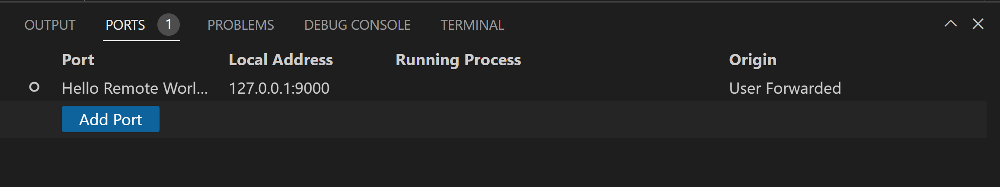
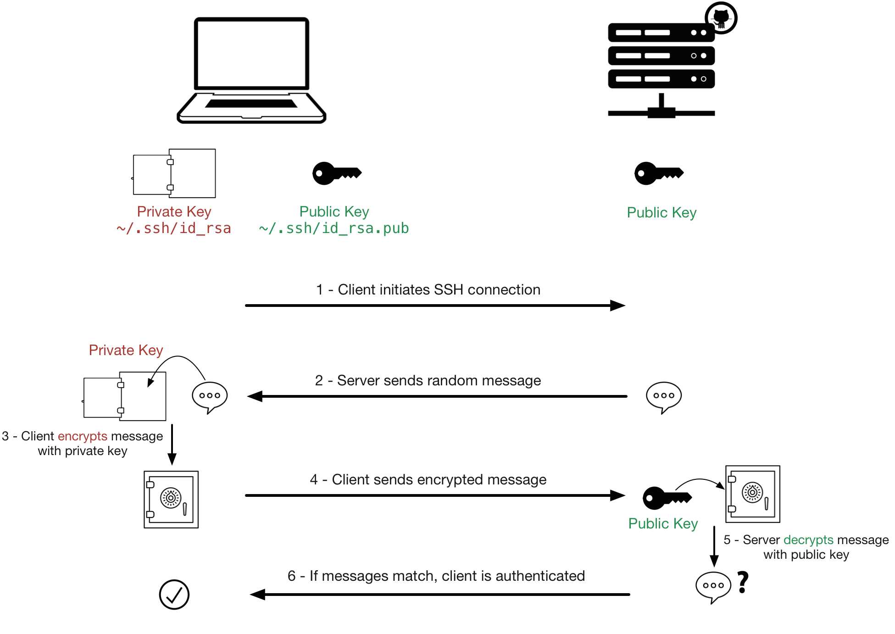

# remote-dev-with-vscode (with SSH)
Prevent my machine hanging, share process to other maching via SSH remote.
open MyCos session


ref: https://code.visualstudio.com/docs/remote/remote-overview

## Objective
  - able to remote dev from macos which use window for complie and codebase.

## Limitation
  - Cannot remote visual studio especially, old version 2013, 2017, 2019
  - Cannot ssh to AzureAD local login (maybe can but not deep research yet)

## Table of Contents


## Pre Installlation
we need theses tools
### Client Side
1. [Visual Studio Code](https://code.visualstudio.com)
2. [Remote Devlopment Extension](https://marketplace.visualstudio.com/items?itemName=ms-vscode-remote.vscode-remote-extensionpack)
3. Open SSH Client
   - Macos -> Already had from OS
   - Window -> Install the [Windows OpenSSH Client](https://learn.microsoft.com/en-us/windows-server/administration/openssh/openssh_install_firstuse?tabs=gui)

### Remote Side
1. Windows - Install the [Windows OpenSSH Server](https://learn.microsoft.com/en-us/windows-server/administration/openssh/openssh_install_firstuse?tabs=gui)
2. Macos - [Enable Remote](https://support.apple.com/guide/mac-help/allow-a-remote-computer-to-access-your-mac-mchlp1066/mac)
3. Create a machine user if no user yet (if the codebase need admin user please create user with admin role)


## What is SSH?
SSH aka Secure Shell, is a cryptographic network protocol used for secure communication between a client and a server over an unsecured network.

working on Port 22
- access to remote via cli
- transfer file between them
- etc.

## Forward Port
After we connected remote, then we can forward port from remote to run in our local machine.



## Public Key Authentication
We conect to remote and italways prompts to enter remote's user password, now we can ignore them.
after we stored client's public key in remote, top level step that first client request/ping to remote then remote send back with random message encypt with public key which only private key in client can decypt
then client send decypt message to server if both side valid now we can ssh to remote without asking password.


### Step install for public key auth
theses step show how to install releate tools.
1. Create an SSH key pair on **Client**
   If you don't have an SSH key pair, open a bash shell or the command line and type in:
   ```
   ssh-keygen -t ed25519
   ```
   Leave a passphrase blank for now.
   
   After success we will have files in folder ./ssh (window on C:/Users/[username]) id_ed25519 and **id_ed25519.pub** which contains our public SSH key
2. Copy client's public key to stored remote
